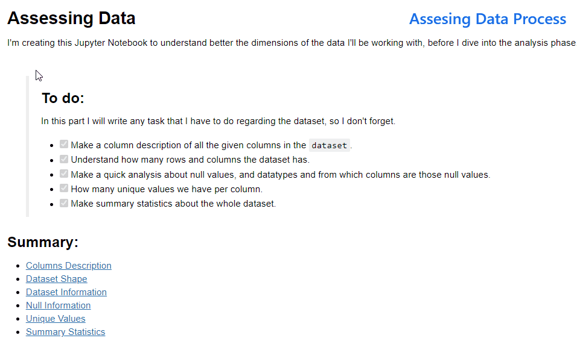

# Investigating a movie dataset 🧐

## Project Description 📓: 
What can we say about the success of a movie 🎥 before it is released? That question 🤔 among others is what we're trying to figure out with this case study!

## Steps:
For this project I did:
### Assessing Data 🔍:
[Click Here](https://github.com/davidtc8/Movies_Data_Analysis/tree/master/Data%20Asessing) if you want to know more about how to _**assess data**_ in Pandas.

### Data Cleansing 🧹
[Click Here](https://github.com/davidtc8/Movies_Data_Analysis/tree/master/Data%20cleansing%20and%20data%20wrangling) if you want to know more about how to _**clean data**_, this is a highly demand skill, because you will always encounter _**data quality issues**_.

###Exploratory Data Analysis 💡 and Data Visualization 📈

## Questions addressed in this dataset 🤔:
- Highest revenue per year, and from which movie.
- What's the genre that generated more revenue and which one is the genre that has the best votes.
- Average Revenue per Genre from 1960-2015.
- Correlations between Revenue and Budget.
- Correlations between Budget and Popularity.

## Example of the code:

## Credits:
Data Analyst Udacity Nanodegree Course.
